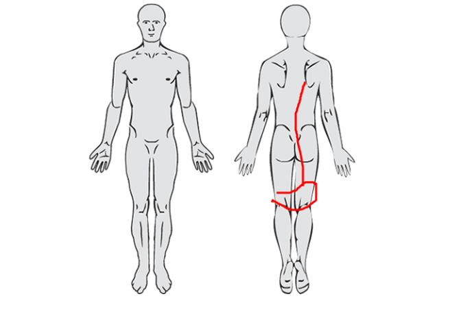

<!-- README.md is generated from README.Rmd. Please edit that file -->

# paindrawr

<!-- badges: start -->

<!-- badges: end -->

**paindrawr** helps you import, transform, quantify, and visualise *pain
drawings* — schematic illustrations on which patients mark where they
feel pain on an outline of the human body.

Pain drawings have traditionally been scored by dividing the body into a
fixed set of anatomical regions and recording, for each region, whether
it was marked or not. Modern digital tools (web and tablet apps) instead
capture each drawing as a series of pen-stroke *x/y coordinates*. This
coordinate-based data is far richer, but it is also harder to work with.
paindrawr provides a consistent workflow for turning that raw coordinate
data into figures and quantitative summaries.

## Installation

You can install the development version of paindrawr from
[GitHub](https://github.com/steenharsted/paindrawr) with:

``` r
pak::pak("steenharsted/paindrawr")
```

## Data structure

paindrawr works with a tibble in which each row is one respondent. The
pain drawings themselves live in a dedicated list-column, so that each
drawing — its metadata, strokes, and point coordinates — travels
alongside any covariates you have collected (for example sex, age,
symptom duration, or pain intensity). The list column name defaults to
`pdr_data`, but can take any name. The package ships with
`pdr_example_tibble`, a ready-to-use example in exactly this format,
which is used throughout the documentation.

A detailed description of the pain-drawing data structure will be
provided in a separate vignette.

## Example

paindrawr is built to work within the
[tidyverse](https://www.tidyverse.org/): drawings are stored in a
list-column of a tibble, and the `pdr_*()` functions are designed to be
used with the native pipe (`|>`) alongside familiar verbs like
`mutate()`, `filter()`, and `head()`. The examples below load the
tidyverse for this reason.

The example dataset contains 50 respondents, each with a pain drawing in
the `pdr_data` column plus a few covariates:

``` r
library(paindrawr)
library(tidyverse)

pdr_example_data
#> # A tibble: 50 × 6
#>    id                               pdr_data          sex     age duration  pain
#>    <chr>                            <list>            <fct> <dbl> <fct>    <dbl>
#>  1 6d63804892233bbb18bc21bcf0d81d0d <named list [10]> Fema…  49.1 Subacute     4
#>  2 c8b12cd45d08e94241d4de9990d60f71 <named list [10]> Fema…  58.9 Subacute    10
#>  3 25062ac7dbeb08d8b532ac474a7849ca <named list [10]> Male   37.1 Subacute     4
#>  4 0dc657fa6ed70150f9596fe692f2f9a0 <named list [10]> Male   65.6 Chronic      1
#>  5 fb61c33ffa09270a5c7931813e9d2d71 <named list [10]> Fema…  72.2 Acute        0
#>  6 328d31503202db3e5c1b8e78f287810e <named list [10]> Male   37.3 Subacute     0
#>  7 e07d8d7e7034ba3ae7f907de022af58d <named list [10]> Male   87.9 Subacute     9
#>  8 9996f1a95c8e939c6ab6258bfc76f722 <named list [10]> Fema…  62.6 Chronic     10
#>  9 41aa308e694ad270b7cfaea054c7c1a2 <named list [10]> Male   82.1 Chronic      1
#> 10 0bcfd36a71b799e857f13c29011d21ff <named list [10]> Male   57   Acute        1
#> # ℹ 40 more rows
```

Metadata stored inside each drawing can be pulled out with
`pdr_get_info()`. Because the drawings live in a list-column, you can
add drawing-level metadata as new columns with `mutate()` — for example
the canvas width of each drawing:

``` r
pdr_example_data|>
  mutate(width = pdr_get_info(pdr_data, var = ".width"))
#> # A tibble: 50 × 7
#>    id                              pdr_data     sex     age duration  pain width
#>    <chr>                           <list>       <fct> <dbl> <fct>    <dbl> <int>
#>  1 6d63804892233bbb18bc21bcf0d81d… <named list> Fema…  49.1 Subacute     4   450
#>  2 c8b12cd45d08e94241d4de9990d60f… <named list> Fema…  58.9 Subacute    10   450
#>  3 25062ac7dbeb08d8b532ac474a7849… <named list> Male   37.1 Subacute     4   450
#>  4 0dc657fa6ed70150f9596fe692f2f9… <named list> Male   65.6 Chronic      1   450
#>  5 fb61c33ffa09270a5c7931813e9d2d… <named list> Fema…  72.2 Acute        0   450
#>  6 328d31503202db3e5c1b8e78f28781… <named list> Male   37.3 Subacute     0   450
#>  7 e07d8d7e7034ba3ae7f907de022af5… <named list> Male   87.9 Subacute     9   450
#>  8 9996f1a95c8e939c6ab6258bfc76f7… <named list> Fema…  62.6 Chronic     10   450
#>  9 41aa308e694ad270b7cfaea054c7c1… <named list> Male   82.1 Chronic      1   450
#> 10 0bcfd36a71b799e857f13c29011d21… <named list> Male   57   Acute        1   450
#> # ℹ 40 more rows
```

### Recreate a single drawing

`pdr_plot_drawing()` redraws an individual pain drawing from its
coordinates. Pipe in a single row of the tibble:

``` r
pdr_example_data|>
  head(1) |>
  pdr_plot_drawing()
```


### Adding bakground image

Plots of individual drawings and heatmaps are more interpretable when
they include the background image that used during datacollection.

``` r
background <- png::readPNG("inst/extdata/mird_body_background.png")

pdr_example_data|>
  head(1) |>
  pdr_plot_drawing(
    background_image = background
  )
```



### Heatmaps across groups

`pdr_plot_heatmap()` aggregates many drawings into density heatmaps,
optionally stratified by one or two grouping variables. Here we stratify
by symptom duration:

``` r
pdr_example_data|>
  pdr_plot_heatmap(
    variables = "duration", 
    background_image = background)
```


## Typical workflow

paindrawr functions are organised around a common analysis pipeline:

- **Import** raw drawings — `pdr_import_json()`, `pdr_import_mird()`
- **Check** that the data is well-formed — `pdr_check_data()`
- **Modify** and clean drawings — `pdr_modify()`, `pdr_anatomy_merge()`
- **Quantify** the marked areas — `pdr_poly_areas()`,
  `pdr_get_alpha_area()`
- **Visualise** the results — `pdr_plot_drawing()`, `pdr_plot_heatmap()`

## Rendering this README

This file is generated from `README.Rmd`. After editing, re-render it
with `devtools::build_readme()` and commit the resulting `README.md` and
any figure files under `man/figures/` so they display on GitHub.
