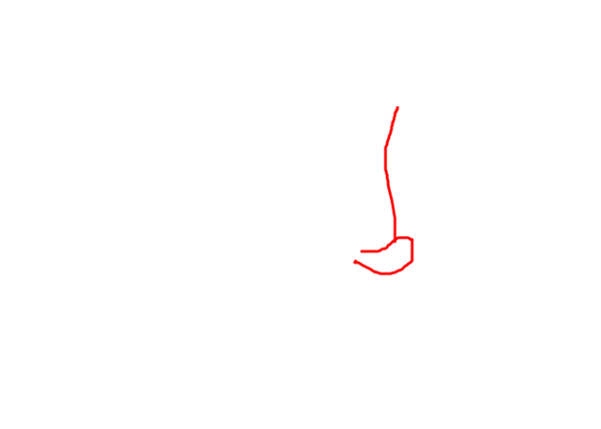
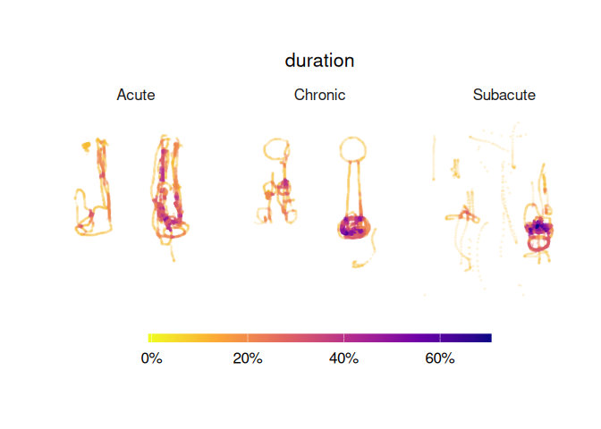

<!-- README.md is generated from README.Rmd. Please edit that file -->

# paindrawr

<!-- badges: start -->

<!-- badges: end -->

**paindrawr** helps you import, transform, quantify, and visualise *pain
drawings* — schematic illustrations on which patients mark where they
feel pain on an outline of the human body.

Pain drawings have traditionally been scored by dividing the body into a
fixed set of anatomical regions and recording, for each region, whether
it was marked or not. Modern digital tools (web and tablet apps) instead
capture each drawing as a series of pen-stroke *x/y coordinates*. This
coordinate-based data is far richer, but it is also harder to work with.
paindrawr provides a consistent workflow for turning that raw coordinate
data into figures and quantitative summaries.

## Installation

You can install the development version of paindrawr from
[GitHub](https://github.com/steenharsted/paindrawr) with:

``` r
pak::pak("steenharsted/paindrawr")
```

## Data structure

paindrawr works with a tibble in which each row is one respondent. The
pain drawings themselves live in a dedicated list-column, so that each
drawing — its metadata, strokes, and point coordinates — travels
alongside any covariates you have collected (for example sex, age,
symptom duration, or pain intensity). The list column name defaults to
`pdr_data`, but can take any name. The package ships with
`pdr_example_tibble`, a ready-to-use example in exactly this format,
which is used throughout the documentation.

A detailed description of the pain-drawing data structure will be
provided in a separate vignette.

## Example

paindrawr is built to work within the
[tidyverse](https://www.tidyverse.org/): drawings are stored in a
list-column of a tibble, and the `pdr_*()` functions are designed to be
used with the native pipe (`|>`) alongside familiar verbs like
`mutate()`, `filter()`, and `head()`. The examples below load the
tidyverse for this reason.

The example dataset contains 50 respondents, each with a pain drawing in
the `pdr_data` column plus a few covariates:

``` r
library(paindrawr)
library(tidyverse)
#> ── Attaching core tidyverse packages ──────────────────────── tidyverse 2.0.0 ──
#> ✔ dplyr     1.2.1     ✔ readr     2.2.0
#> ✔ forcats   1.0.1     ✔ stringr   1.6.0
#> ✔ ggplot2   4.0.3     ✔ tibble    3.3.1
#> ✔ lubridate 1.9.5     ✔ tidyr     1.3.2
#> ✔ purrr     1.2.2     
#> ── Conflicts ────────────────────────────────────────── tidyverse_conflicts() ──
#> ✖ dplyr::filter() masks stats::filter()
#> ✖ dplyr::lag()    masks stats::lag()
#> ℹ Use the conflicted package (<http://conflicted.r-lib.org/>) to force all conflicts to become errors

pdr_example_tibble
#> # A tibble: 50 × 5
#>    pdr_data            sex   age duration  pain
#>    <list>            <int> <dbl> <chr>    <dbl>
#>  1 <named list [10]>     0  47.6 Subacute     4
#>  2 <named list [10]>     1  66.4 Acute        2
#>  3 <named list [10]>     1  25.8 Subacute     2
#>  4 <named list [10]>     1  23.1 Acute        5
#>  5 <named list [10]>     1  54.5 Chronic      3
#>  6 <named list [10]>     1  24.2 Subacute    10
#>  7 <named list [10]>     0  86.8 Acute        6
#>  8 <named list [10]>     1  18   Subacute    10
#>  9 <named list [10]>     0  52.5 Chronic     10
#> 10 <named list [10]>     0  39.7 Subacute     4
#> # ℹ 40 more rows
```

Metadata stored inside each drawing can be pulled out with
`pdr_get_info()`. Because the drawings live in a list-column, you can
add drawing-level metadata as new columns with `mutate()` — for example
the canvas width of each drawing:

``` r
pdr_example_tibble |>
  mutate(width = pdr_get_info(pdr_data, var = ".width"))
#> # A tibble: 50 × 6
#>    pdr_data            sex   age duration  pain width
#>    <list>            <int> <dbl> <chr>    <dbl> <int>
#>  1 <named list [10]>     0  47.6 Subacute     4   450
#>  2 <named list [10]>     1  66.4 Acute        2   450
#>  3 <named list [10]>     1  25.8 Subacute     2   450
#>  4 <named list [10]>     1  23.1 Acute        5   450
#>  5 <named list [10]>     1  54.5 Chronic      3   450
#>  6 <named list [10]>     1  24.2 Subacute    10   450
#>  7 <named list [10]>     0  86.8 Acute        6   450
#>  8 <named list [10]>     1  18   Subacute    10   450
#>  9 <named list [10]>     0  52.5 Chronic     10   450
#> 10 <named list [10]>     0  39.7 Subacute     4   450
#> # ℹ 40 more rows
```

### Recreate a single drawing

`pdr_plot_drawing()` redraws an individual pain drawing from its
coordinates. Pipe in a single row of the tibble:

``` r
pdr_example_tibble |>
  head(1) |>
  pdr_plot_drawing()
```



### Heatmaps across groups

`pdr_plot_heatmap()` aggregates many drawings into density heatmaps,
optionally stratified by one or two grouping variables. Here we stratify
by symptom duration:

``` r
pdr_example_tibble |>
  pdr_plot_heatmap(variables = "duration")
```



## Typical workflow

paindrawr functions are organised around a common analysis pipeline:

- **Import** raw drawings — `pdr_import_json()`, `pdr_import_mird()`
- **Check** that the data is well-formed — `pdr_check_data()`
- **Modify** and clean drawings — `pdr_modify()`, `pdr_anatomy_merge()`
- **Quantify** the marked areas — `pdr_poly_areas()`,
  `pdr_get_alpha_area()`
- **Visualise** the results — `pdr_plot_drawing()`, `pdr_plot_heatmap()`

## Rendering this README

This file is generated from `README.Rmd`. After editing, re-render it
with `devtools::build_readme()` and commit the resulting `README.md` and
any figure files under `man/figures/` so they display on GitHub.
